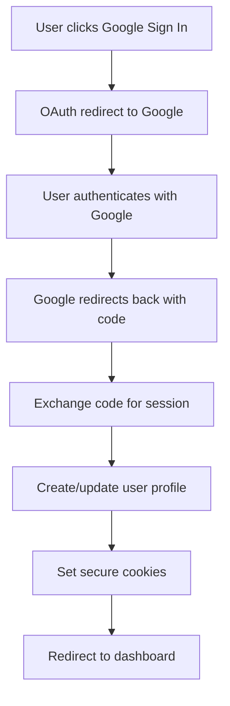

# 🔐 Robust Authentication System

This document outlines the comprehensive authentication system built for the US Associate SaaS platform, featuring Google OAuth, email/password authentication, and robust error handling.

## 🚀 Features

### **Core Authentication**
- **Google OAuth 2.0** with PKCE flow
- **Email/Password** authentication
- **Automatic session management** with refresh tokens
- **Row Level Security (RLS)** integration
- **Multi-tenant support**

### **Robust Error Handling**
- **Network error recovery** with automatic retries
- **User-friendly error messages** for all failure scenarios
- **Timeout protection** for authentication requests
- **Comprehensive error boundaries** for React components
- **Fallback mechanisms** for degraded states

### **Security Features**
- **PKCE (Proof Key for Code Exchange)** for enhanced OAuth security
- **Secure cookie management** with proper flags
- **Token refresh** with automatic handling
- **CSRF protection** through proper redirect handling
- **Input validation** with Zod schemas

## 🏗️ Architecture

### **Authentication Flow**



### **Component Structure**

```
src/
├── components/auth/
│   ├── auth-guard.tsx          # Route protection
│   ├── auth-check.tsx          # Authentication verification
│   ├── login-form.tsx          # Enhanced login form
│   ├── signup-form.tsx         # Enhanced signup form
│   ├── error-boundary.tsx      # Error handling
│   └── dashboard-wrapper.tsx   # Dashboard layout wrapper
├── hooks/
│   └── use-auth.ts             # Authentication state management
├── lib/
│   ├── supabase.ts             # Enhanced Supabase client
│   └── supabase/
│       ├── client.ts           # Client-side Supabase
│       └── server.ts           # Server-side Supabase
└── app/
    ├── auth/callback/          # OAuth callback handler
    ├── login/                  # Login page
    └── signup/                 # Signup page
```

## 🔧 Configuration

### **Environment Variables**

```bash
# Supabase Configuration
NEXT_PUBLIC_SUPABASE_URL=your_supabase_url
NEXT_PUBLIC_SUPABASE_ANON_KEY=your_supabase_anon_key
SUPABASE_SERVICE_ROLE_KEY=your_service_role_key

# OAuth Configuration (configured in Supabase dashboard)
# Google OAuth client ID and secret
# Redirect URLs: http://localhost:3000/auth/callback (dev)
#              https://yourdomain.com/auth/callback (prod)
```

### **Supabase Setup**

1. **Enable Google OAuth** in Supabase Auth settings
2. **Configure redirect URLs** for your domains
3. **Set up RLS policies** for user data protection
4. **Create necessary database tables** (profiles, user_settings, etc.)

## 📱 Usage

### **Protected Routes**

```tsx
import { RequireAuth, RequireRole } from '@/components/auth/auth-guard'

// Basic authentication required
<RequireAuth>
  <ProtectedComponent />
</RequireAuth>

// Role-based access control
<RequireRole role="admin">
  <AdminOnlyComponent />
</RequireRole>

// Multiple roles allowed
<RequireRole role={['admin', 'moderator']}>
  <ModeratedComponent />
</RequireRole>
```

### **Authentication Hook**

```tsx
import { useAuth } from '@/hooks/use-auth'

function MyComponent() {
  const { user, isLoading, isAuthenticated, signOut } = useAuth()
  
  if (isLoading) return <div>Loading...</div>
  if (!isAuthenticated) return <div>Please log in</div>
  
  return (
    <div>
      <p>Welcome, {user?.email}!</p>
      <button onClick={signOut}>Sign Out</button>
    </div>
  )
}
```

### **Error Handling**

```tsx
import { AuthErrorBoundary } from '@/components/auth/error-boundary'

<AuthErrorBoundary
  onError={(error, errorInfo) => {
    // Custom error logging
    console.error('Auth error:', error, errorInfo)
  }}
>
  <AuthenticationComponent />
</AuthErrorBoundary>
```

## 🛡️ Error Handling

### **Network Errors**
- **Automatic retry** with exponential backoff
- **User-friendly messages** for connection issues
- **Fallback to manual retry** after max attempts

### **OAuth Errors**
- **Comprehensive error mapping** for Google OAuth responses
- **Clear user guidance** for common issues
- **Graceful degradation** when OAuth fails

### **Session Errors**
- **Automatic token refresh** handling
- **Session validation** on route changes
- **Secure logout** on authentication failures

## 🔄 State Management

### **Authentication State**

```typescript
interface AuthState {
  user: User | null
  isLoading: boolean
  isAuthenticated: boolean
  error: string | null
}
```

### **User Profile**

```typescript
interface User {
  id: string
  email: string
  role: string
  first_name?: string
  last_name?: string
  avatar_url?: string
}
```

### **State Transitions**

1. **Initial Load**: `isLoading: true`
2. **Authenticated**: `isAuthenticated: true, user: User`
3. **Unauthenticated**: `isAuthenticated: false, user: null`
4. **Error State**: `error: string, isAuthenticated: false`

## 🚨 Troubleshooting

### **Common Issues**

#### **"Failed to fetch" Error**
- Check network connectivity
- Verify Supabase URL is correct
- Ensure CORS is properly configured
- Check browser console for detailed errors

#### **OAuth Redirect Issues**
- Verify redirect URLs in Supabase dashboard
- Check that callback route is accessible
- Ensure proper environment variables

#### **Session Persistence Issues**
- Check cookie settings and security flags
- Verify token refresh is working
- Check browser storage policies

### **Debug Mode**

Enable detailed logging in development:

```typescript
// In supabase.ts
if (process.env.NODE_ENV === 'development') {
  console.log('Supabase client initialized with:', { supabaseUrl })
}
```

## 🔒 Security Considerations

### **OAuth Security**
- **PKCE flow** prevents authorization code interception
- **State parameter** prevents CSRF attacks
- **Secure redirect URIs** prevent open redirects

### **Session Security**
- **HttpOnly cookies** prevent XSS attacks
- **Secure flag** in production
- **SameSite: lax** for cross-site requests
- **Token expiration** and automatic refresh

### **Data Protection**
- **Row Level Security** on all user data
- **Input validation** with Zod schemas
- **SQL injection protection** through Supabase
- **XSS prevention** through proper escaping

## 📈 Performance

### **Optimizations**
- **Lazy loading** of authentication components
- **Efficient state updates** with React hooks
- **Minimal re-renders** through proper dependency arrays
- **Background token refresh** without blocking UI

### **Monitoring**
- **Authentication success rates**
- **Error frequency and types**
- **Session duration metrics**
- **OAuth flow completion rates**

## 🧪 Testing

### **Test Scenarios**
- **Successful authentication** flows
- **Network error handling** and recovery
- **Session expiration** and refresh
- **Role-based access control**
- **Error boundary** functionality

### **Mock Data**
- **Test users** with various roles
- **Mock OAuth responses** for development
- **Error simulation** for testing error handling

## 🔮 Future Enhancements

### **Planned Features**
- **Multi-factor authentication** (MFA)
- **Social login providers** (GitHub, LinkedIn)
- **Advanced role management** with permissions
- **Audit logging** for authentication events
- **Rate limiting** for authentication attempts

### **Integration Opportunities**
- **Single Sign-On (SSO)** for enterprise customers
- **Federation** with external identity providers
- **Advanced analytics** for user behavior
- **A/B testing** for authentication flows

---

## 📚 Additional Resources

- [Supabase Auth Documentation](https://supabase.com/docs/guides/auth)
- [Google OAuth 2.0 Guide](https://developers.google.com/identity/protocols/oauth2)
- [Next.js Authentication Patterns](https://nextjs.org/docs/authentication)
- [React Error Boundaries](https://reactjs.org/docs/error-boundaries.html)

---

*This authentication system is designed to be production-ready with enterprise-grade security and reliability.*
